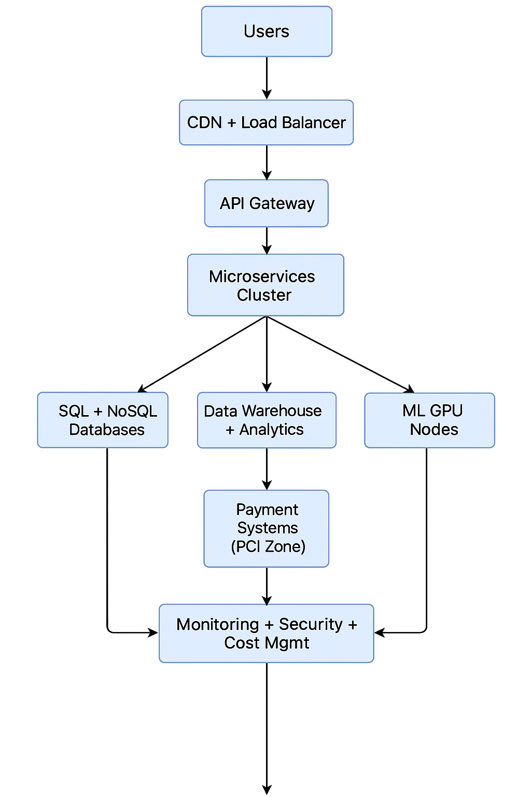

# Lab 9: ShopPro International

**Student Name:** *Jigarkumar Patel*  
**Course:** Cloud Migration  

---

## Project Overview

**Scenario:**  
ShopPro International is a global eCommerce company operating in North America, Europe, and Asia-Pacific. The company plans to migrate its on-premises infrastructure to the cloud to enhance scalability, performance, and cost efficiency.  

Their applications handle millions of transactions daily, including web front-end, back-end APIs, payment systems, inventory, analytics, and ML workloads. The migration must ensure security, reliability, and global performance while remaining cost-effective.

---

## Objectives

- Estimate migration, operational, and management costs using cloud pricing calculators (Azure, AWS, GCP).  
- Develop a cost optimization strategy using cloud-native tools and discounts.  
- Create a 3-year cost projection to accommodate growth and scalability.  
- Recommend sustainable cloud practices for energy efficiency and cost control.

---

## Cloud Migration Components

| Component | Description | Key Requirements |
|------------|--------------|------------------|
| Web Front-End Cluster | 10 VMs per region (NA, EU, APAC) | Load balancing, CDN |
| API Back-End Services | 50 microservices across 20 VMs | Auto-scaling, containerization |
| Payment Processing | PCI-compliant high-security VMs | Encryption, isolation |
| Database Layer | SQL (5TB), NoSQL (10TB), Data Warehouse (15TB) | High availability, replication |
| ML Processing | GPU-enabled VMs for training | Batch jobs, scalability |
| Backup & DR | Geo-redundant storage | Multi-region replication |
| Monitoring & Management | Performance & security tools | Cost tracking, automation |

---

# Section 1: Cost Estimate Report

### **1.1 Migration Cost (One-Time)**

| Component | Service | Estimation | Example Services |
|------------|----------|-------------|------------------|
| Database Migration | Database Migration Service | 30 TB total transfer | Azure DMS / AWS DMS / GCP DMS |
| Application Migration | Azure Migrate / AWS Migration Hub | Includes temporary test resources | Azure Migrate |
| Data Transfer | Network egress + CDN replication | ~$0.09/GB outbound | Azure CDN / CloudFront |

Total Estimated Migration Cost: ~$8,000 – $10,000 (one-time)  

---

### **1.2 Operational Cost (Monthly)**

| Component | Quantity | Service | Region(s) | Est. Monthly Cost |
|------------|-----------|----------|------------|-------------------|
| Web Front-End (10/region × 3) | 30 | Standard_B2s VMs | NA, EU, APAC | $1,200 |
| API Microservices (20 VMs) | 20 | B2ms / App Service | Global | $800 |
| Payment Processing | 6 | D2s_v3 + Encryption | Secure Zone | $1,000 |
| SQL Database | 5 TB | Azure SQL Database (P15) | Multi-region | $2,000 |
| NoSQL Database | 10 TB | Cosmos DB | Multi-region | $1,500 |
| Data Warehouse | 15 TB | Synapse Analytics | Global | $2,500 |
| ML GPU Nodes | 4 | NC4as_T4_v3 | Global | $2,000 |
| Storage & Backup | 40 TB | GRS Storage | Multi-region | $800 |
| Networking (LB, CDN, VPN) | - | Front Door, VPN Gateway | Global | $600 |
| Monitoring & Mgmt | - | Azure Monitor | Global | $300 |

Estimated Monthly Cost: ≈ $12,700

---

### **1.3 Management Cost**

| Tool | Service | Monthly Cost |
|------|----------|--------------|
| Monitoring & Logs | Azure Monitor / CloudWatch | $200 |
| Cost Management | Azure Cost Mgmt / Budgets | $100 |
| Security Mgmt | Defender / Security Hub | $200 |
| Auto-Shutdown, Tagging | Native Tools | Minimal |

Total Management Cost: ~$500/month

---

### **1.4 Architecture Overview**

---

# Section 2: Cost Optimization Strategy

Cloud computing enables multiple ways to reduce costs without sacrificing performance or security.  

---

### **2.1 Cost-Saving Techniques**

| Optimization Technique | Description | Potential Savings |
|-------------------------|--------------|-------------------|
| **Reserved Instances** | Commit to 1- or 3-year terms for critical VMs and databases to secure lower hourly rates. | 40–60 % |
| **Auto-Scaling** | Automatically adjusts compute resources based on real-time demand to avoid over-provisioning. | 25–35 % |
| **Spot / Pre-emptible VMs** | Use for temporary, non-critical workloads such as data analytics or ML training jobs. | 70–80 % |
| **Azure Hybrid Benefit / License Mobility** | Reuse existing Windows Server or SQL Server licenses to reduce OS and database costs. | 30–40 % |
| **Storage Tiering** | Move cold or archival data to cheaper tiers such as Azure Archive Storage or S3 Glacier. | Up to 60 % |
| **Serverless Functions** | Replace small or intermittent APIs with Function-as-a-Service (Azure Functions, AWS Lambda). | Pay-per-use only |
| **Right-Sizing** | Continuously monitor CPU / memory usage and downsize under-utilized instances. | 10–20 % |

**Result:** Base cost ≈ $12 700 / month → optimized ≈ $8 000 – $9 000 / month

---

### **2.2 Implementation Plan**

**Phase 1 – Immediate (0–2 months)**  
- Enable Azure Hybrid Benefit for Windows VMs and SQL Databases.  
- Configure auto-shutdown schedules for development / test environments.  
- Activate Azure Advisor or equivalent to begin right-sizing recommendations.

**Phase 2 – Short Term (3–6 months)**  
- Purchase 1-year reserved instances for production workloads.  
- Apply storage lifecycle policies to automatically archive cold data.  
- Consolidate low-traffic microservices using App Service Plans or containers.

**Phase 3 – Long Term (6–12 months)**  
- Introduce serverless functions for lightweight APIs or scheduled background jobs.  
- Integrate cost-management alerts and dashboards to track budgets.  
- Evaluate newer VM series for improved cost-to-performance ratio annually.

---

### **2.3 Pricing Comparison Example**

| Resource | Pay-as-you-Go | 1-Year Reserved | 3-Year Reserved |
|-----------|---------------|-----------------|-----------------|
| Standard B2s VM | $70 / month | $45 / month | $30 / month |
| SQL Database (P15) | $2 000 / month | $1 400 / month | $1 100 / month |
| GPU Node (NC4as T4 v3) | $500 / month | $350 / month | $300 / month |

**Average 3-Year Reserved Savings:** ≈ 45 – 55 %

---

### **2.4 Optimization Outcomes**

By implementing these strategies:  
- Operational costs drop by ~35 %.  
- Resource utilization improves through automation and scaling.  
- Sustainability goals are supported by eliminating idle infrastructure.  
- Cost visibility is enhanced using tagging, dashboards, and budget alerts.

Continuous monitoring and periodic right-sizing ensure long-term financial efficiency without compromising global availability or security.

---

# Section 3: Future Growth & Budget Projection (3 Years)

ShopPro International’s business growth will require scalable infrastructure capable of handling increased global traffic, data analytics, and machine-learning workloads.  

---

### **3.1 Growth Projection Table**

| Year | User Growth | Scale Factor | Projected Monthly Cost (USD) | Optimization Actions |
|------|--------------|--------------|------------------------------|----------------------|
| **2025** | Base Year | 100 % | ~$12 700 | Initial deployment and configuration |
| **2026** | +25 % | 125 % | ~$15 000 | Apply reserved instances and auto-scaling |
| **2027** | +50 % | 150 % | ~$17 500 | Expand with serverless APIs and caching layers |
| **2028** | +75 % | 175 % | ~$19 000 | Migrate to newer VM families and optimize storage |

These figures assume moderate user-growth trends and global traffic expansion.  
With continuous optimization, overall cost growth is expected to remain under 25 % while supporting a 75 % increase in workload demand.

---

### **3.2 Cost Control & Efficiency Recommendations**

1. **Autoscaling & Load Balancing**  
   - Enable horizontal scaling for API and web clusters.  
   - Configure dynamic scaling policies to handle peak-period traffic (e.g., sales events).

2. **Data & Storage Management**  
   - Move historical analytics data to cold / archive tiers to lower storage cost.  
   - Use data-lifecycle policies for automated archiving after 90 days.

3. **Compute Optimization**  
   - Re-evaluate VM families annually (e.g., move from B-series to D-series or F-series as prices drop).  
   - Introduce container orchestration (AKS / EKS / GKE) for better utilization.

4. **Financial Governance**  
   - Use Azure Cost Management, AWS Budgets, or GCP Billing Reports to track real-time usage.  
   - Apply tagging and resource-group policies for charge-back and accountability.

---

### **3.3 Sustainability & Energy Efficiency Benefits**

| Factor | Description | Impact |
|---------|--------------|--------|
| **Elastic Scaling** | Scale resources up / down dynamically | Prevents idle VMs and wasted energy |
| **Serverless Adoption** | Compute runs only during demand | Minimizes power usage |
| **Cloud Carbon Efficiency** | Data centers powered by renewable energy | Lowers CO₂ footprint |
| **Resource Consolidation** | Shared cloud infrastructure | Reduces hardware waste |

**Outcome:** Cloud elasticity and green data-center operations help ShopPro International align with sustainability goals while optimizing cost efficiency.

---

### **3.4 Long-Term Financial Outlook**

- **Projected Savings Over 3 Years:** ~ $120 000 – $150 000 (through reserved instances + autoscaling).  
- **Total 3-Year Spend:** ≈ $540 000 – $580 000 (inclusive of growth).  
- **Sustainability ROI:** ~ 15 % annual efficiency gain from energy reduction and optimized resource usage.  

By combining predictive cost management, reserved resources, and serverless integration, ShopPro International can scale globally while keeping operational spending under control.

---
