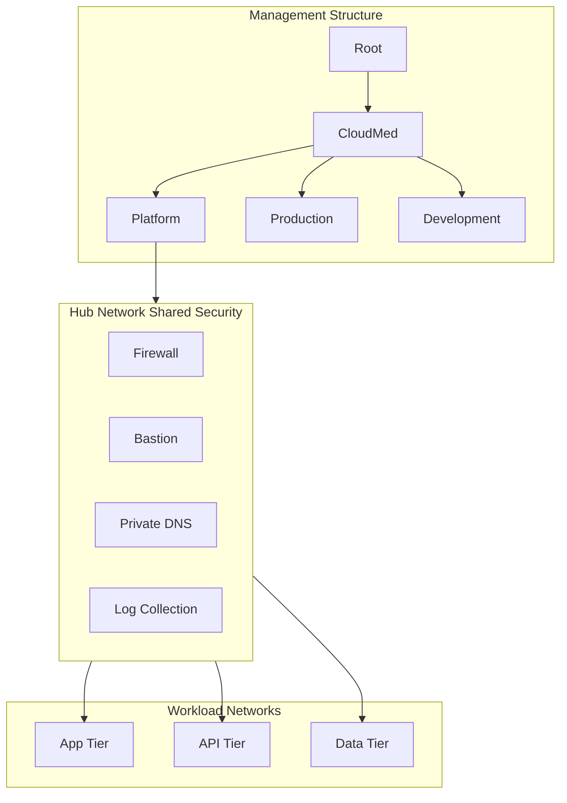

# CloudMed Solutions Zero Trust Azure Landing Zone Design

## 1. Company Overview

CloudMed Solutions is a healthcare technology company that offers cloud based telemedicine and patient management services.  
The company supports hospitals and clinics in Canada the United States and Europe.  
Their main platform named MedConnect gives doctors and patients a safe way to communicate and also provides electronic medical record features along with health analytics powered by artificial intelligence.

Since CloudMed works with private patient information it must follow strict laws in each region.  
These laws require strong security controls careful data handling and complete visibility over all activity in the cloud environment.

### Compliance Requirements

CloudMed must follow these regulations: 
- HIPAA for the United States  
- GDPR for clients in Europe  
- PIPEDA for clients in Canada  

### Why Zero Trust

Zero Trust is the best approach because:
- Every access request must be verified  
- Users may connect from many locations and devices  
- Healthcare information is highly targeted by attackers  
- CloudMed needs protection in case a breach happens inside the network  

The company operates in Canada Central and West Europe Azure regions which makes identity based security and policy driven control essential.

---

## 2. Governance and Identity

### Management Group Structure:

The environment uses the following structure to organize policy and access

Root 
└── CloudMed 
├── Platform 
├── Production 
└── Development

### Governance Model:

#### RBAC Model

CloudMed uses role based access control to limit who can manage which resources.  
Access is granted only where it is necessary.

| Role | Access Level | Purpose |
|------|--------------|---------|
| Cloud and Security Admin | Owner or Contributor | Manage shared and production resources |
| DevOps Team | Contributor | Manage application and API workloads |
| Finance Team | Cost Reader | View cost and usage information |

#### Azure Policy:

Azure Policy is used to keep the environment consistent and secure.  
Common rules include: 
- Only Canada Central and West Europe can be used  
- Every resource must have tags for Environment CostCenter Owner - DataClassification  
- Public IP addresses are blocked except for approved entry points  
- Diagnostic logs must be enabled  
- Data services must use private endpoints  

#### Identity with Azure Entra ID:

Azure Entra ID is the identity system for all users and applications.  
It provides: 
- Multi factor authentication  
- Conditional Access rules based on sign in risk device health and location  
- Privileged Identity Management for time based admin rights  
- Managed identities so apps can authenticate safely without storing secrets  

---

## 3. Network Architecture

CloudMed uses a hub and spoke network layout.  
The hub contains shared security services and the spokes contain the application workloads.  
This design makes it easy to control movement across the network and apply Zero Trust rules.

### Hub Network
The hub includes these shared tools:
- Azure Firewall  
- Azure Bastion  
- Private DNS Zones  
- Log Analytics Workspace  
- Azure Monitor agents  

### Workload Spokes

Each workload runs in its own spoke network

App Spoke:  
Contains front end applications and the web entry point

API Spoke:  
Contains backend services and microservices

Data Spoke:  
Contains Azure SQL Storage Accounts and Key Vault using private endpoints

### Segmentation and Traffic Control

Network Security Groups control communication inside each spoke.  
The firewall controls traffic that goes across spokes and outside the environment.  
No workload is allowed to communicate directly unless the rule is created on purpose.  
Private endpoints help keep sensitive data off the public internet.

---

## 4. Zero Trust Controls

CloudMed applies Zero Trust ideas throughout the landing zone.  
The design follows three main principles.

### Verify Explicitly

Azure Entra checks every sign in and enforces MFA.  
Conditional Access evaluates device compliance location and risk level.  
All apps use managed identities to communicate with Azure services.

### Least Privilege Access

Access is always limited to the smallest amount needed.  
Admins use time based access through PIM.  
Dev Test and Production are kept separate to avoid unneeded access.

### Assume Breach

The environment is built as if a breach could happen at any time.  
Network segmentation stops attackers from moving sideways.  
Logging monitoring and alerting help detect unusual activity.  
Data is encrypted both in storage and while moving across the network.

### Examples of Zero Trust in This Design

- Azure Bastion removes the need for public SSH or RDP  
- Private Link protects access to SQL and Storage  
- Azure Policy blocks creation of public endpoints  
- Just in Time VM access from Defender for Cloud  
- App API and Data tiers are isolated in different spokes  

---

## 5. Monitoring Compliance and Cost

### Monitoring

CloudMed uses several Azure services to monitor the environment:
- Azure Monitor for alerts and metrics  
- Log Analytics for logs across all resources  
- Application Insights for application performance  
- Firewall and NSG logs stored centrally for analysis  

### Compliance

Azure Policy initiatives help the company follow HIPAA GDPR and PIPEDA.  
Defender for Cloud gives a real time view of security posture and compliance status.  
Audit logs are stored in one place for review.

### Cost Control

Costs are managed through:
- Budgets and alerts  
- Required cost tags  
- Reserved instances for steady workloads  
- Autoscaling for changing workloads  
- Cost dashboards for the finance team  

---

## 6. Conceptual Diagram

This section gives a simple overview of how the Zero Trust landing zone is arranged.  
It highlights the management structure the shared security layer and the workload networks.

## 7. Summary and Recommendations

### Summary

The Zero Trust landing zone created for CloudMed supports healthcare workloads across multiple regions while keeping patient information safe.  
The design uses strong identity controls clear separation of networks private access to data services and consistent rules through Azure Policy.  
These elements help CloudMed meet requirements from HIPAA GDPR and PIPEDA.  
The structure also makes it easier to manage resources and keep track of costs across different environments.

### Recommendations

- Use Terraform or Bicep to automate the landing zone so future deployments stay consistent.  
- Improve cost efficiency by using reserved instances autoscaling features and storage lifecycle settings.  
