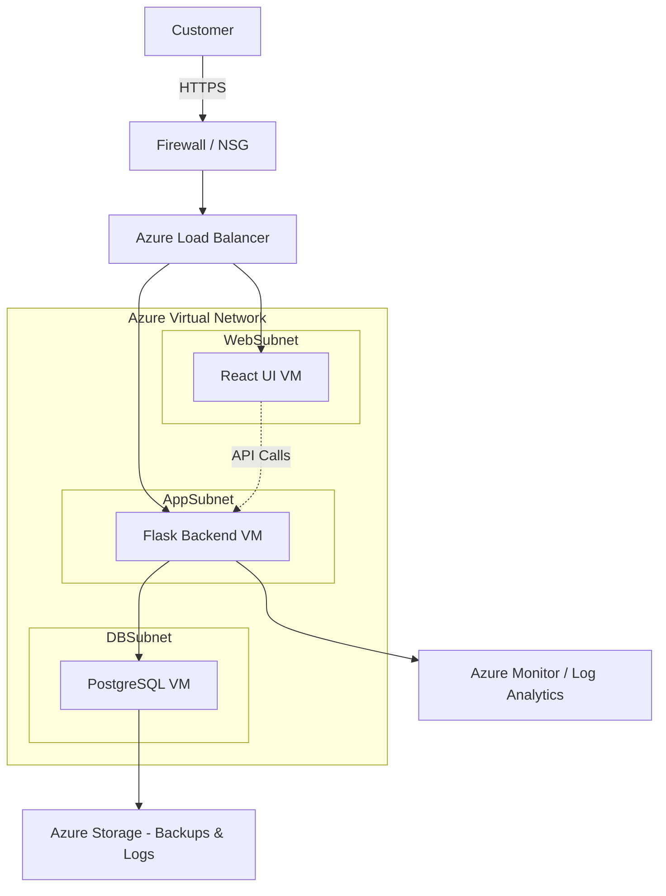
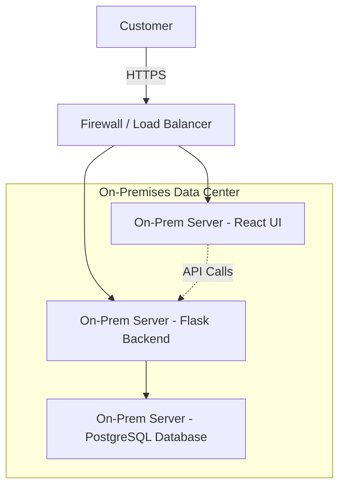

# CST8913- Cloud Migration <br> Lab2-pate1595(Jigarkumar patel) 
### Scenario: The following application consists of a Web Server written in Flask. A UI front end written in React. A database layer consisting of Postgres.


## IaaS Deployment

In this setup, I used Infrastructure as a Service (IaaS) to deploy my system, which has three parts:
- A React UI for the frontend <br>
- A Flask web server for the backend<br>
- A PostgreSQL database for data storage

With IaaS, Azure provides me with virtual machines, networking, and storage, and I am responsible for installing and managing everything inside those VMs.



### The working flow:
1) A customer visits my app in the browser. The request first goes through a firewall (NSG) for security.
2) From there, the request hits the Azure Load Balancer, which decides where to send the traffic.
- If it’s a request for the UI, it goes to the React VM (which serves the static web files).
- If it’s an API call, it goes to the Flask VM.
3) The Flask VM does the logic and talks to the PostgreSQL VM to get or update data.
4) Backups are stored in Azure Storage, and logs/metrics are sent to Azure Monitor so I can track performance.

* This model gives me full control of VMs and networking, but I must manage patching, scaling, and backups myself.
--- 

## PaaS Deployment
For this setup, I used Platform as a Service (PaaS) to deploy the same system:<br> 
- React UI for the frontend<br>
- Flask web server for the backend<br>
- PostgreSQL database for data storage<br>
With PaaS, Azure manages the servers, scaling, and updates for me. I just deploy my code and data, which makes it much easier compared to IaaS.

 ```mermaid
flowchart TD
    %% Customer entry
    C[Customer] -->|HTTPS| FD[Azure Front Door]

    %% Frontend
    FD --> SWA["Azure Static Web App - React UI"]

    %% Backend
    FD --> AS["Azure App Service - Flask Backend"]

    %% React API calls to Backend
    SWA -.->|API Calls| AS

    %% Database
    AS --> PG["Azure Database for PostgreSQL"]

    %% Monitoring
    AS --> MON["Azure Monitor / App Insights"]

    subgraph Cloud[Azure Cloud Services]
        SWA
        AS
        PG
        MON
    end


 ```

### The working flow:
1) A customer connects through Azure Front Door, which manages HTTPS and routing.
2) The React UI is served from Azure Static Web App, so the user’s browser loads the frontend quickly.
3) Once loaded, the React app (running in the browser) makes API calls back through Front Door to the Flask backend running in Azure App Service.
4) The Flask backend processes the requests and communicates with Azure Database for PostgreSQL.
5) Azure Monitor / Application Insights collects logs and metrics for performance and troubleshooting.

* In this, Azure handles infrastructure, scaling, and patching so I can focus only on app code and data.

--- 
## On-Premises Deployment

In this setup, the same system (React UI + Flask backend + PostgreSQL database) is deployed inside a local data center instead of Azure. 
That means I am responsible for all the hardware, servers, networking, power, and cooling.<br>
In this, there is no cloud provider to manage scaling or monitoring, everything is self-hosted.


### The working flow:
1) A customer connects to the application over HTTPS.
2) Traffic first goes through a firewall/load balancer in the local network.
3) The React UI server delivers the frontend (HTML, JS, CSS) to the customer’s browser.
4) The browser makes API calls, which are routed to the Flask backend server.
5) The Flask backend processes requests and interacts with the PostgreSQL database server to read/write data.
* In this, I have full ownership and control, but also full responsibility for hardware, security, and scaling.

--- 

## Comparison of IaaS, PaaS, and On-Premises

| Deployment Model | Who Manages Infrastructure? | Scaling & Updates | Control Level | Example  |
|------------------|-----------------------------|------------------|---------------|----------------------|
| IaaS         | Me                 | Manual           | High (OS, runtime, DB, networking) | React UI VM, Flask VM, PostgreSQL VM |
| PaaS         | Azure                       | Automatic        | Medium (focus on code & config)   | Azure Static Web App, App Service, Azure DB |
| On-Premises  | Me              | Manual           | Maximum (hardware + software)     | Local servers for React, Flask, PostgreSQL |


