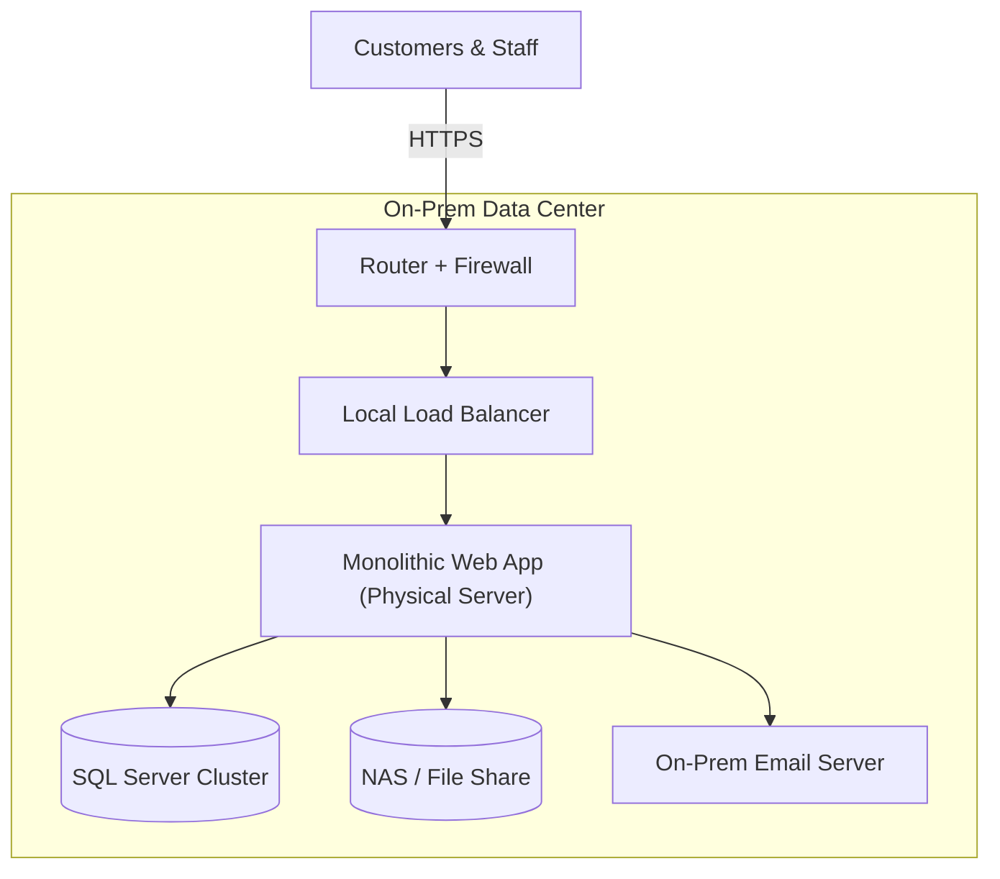

# CST8913- Cloud Migration   Lab3-pate1595(Jigarkumar patel) 

## Section 1: On-Premises Solution Design
### Task-1
#### Diagram: 

--> Behind a router/firewall and a local load balancer, a single, monolithic web application operates on servers controlled by the firm. It communicates with a clustered SQL Server for all data, uses an on-premises SMTP server to deliver notifications, and writes and reads files on a NAS share (SMB/NFS). The network layer provides the security, routing, and availability of internal services; all internet traffic enters through the perimeter devices.

### Task-2
Web application (monolith): 
In order to avoid managing the operating system, patching, or scaling, I'm deploying the web application on PaaS, which offers me built-in autoscale and fast deployments. I will temporarily switch to IaaS if I encounter a hard roadblock. Replatforming either using a buildpack or containerizing storing configuration in environment variables/secrets, and fronting it with a cloud load balancer and WAF are my plans.

SQL database: 
To obtain High Availability, backups, patching, and point-in-time restoration without requiring a lot of DBA effort, I'll utilize a managed SQL PaaS. I'll start with IaaS and switch later if I depend on unsupported extensions or legacy functionalities. During the cutover, I'll verify compatibility, switch to DMS or backup/restore, activate PITR(Point-In-Time Restore), and switch up connection strings.

File storage: 
I’ll move files to object storage to make them safer and cheaper, and to use lifecycle rules and a CDN (Content Delivery Network). If I must keep old SMB/NFS (Server Message Block / Network File System) needs, I’ll run a temporary IaaS (Infrastructure as a Service) file server. I’ll bulk-copy the data using AzCopy (Azure Storage copy utility), AWS S3 (Amazon Simple Storage Service), gsutil (Google Cloud Storage utility), or rsync (remote sync), change the application’s file paths/URLs (Uniform Resource Locators), turn on the CDN (Content Delivery Network), and set lifecycle rules so old files move to lower-cost storage.

Networking (routers, firewalls, load balancer): 
I’ll replace the physical hardware with cloud-native networking: VNet (Virtual Network) / VPC (Virtual Private Cloud), subnets, Security Groups / NSG (Network Security Group), a managed Load Balancer (LB), and a WAF (Web Application Firewall). During migration I’ll keep a hybrid setup using a VPN (Virtual Private Network) or Private Link (the provider’s private endpoint). I’ll use least-privilege access (only the permissions each service needs) and turn on flow logs (network traffic records) and monitoring (logs, metrics, alerts).  
Goal: no public data stores, stable latency, and clear observability.

Email service (notifications): 
For user mailboxes and compliance, I’ll use a SaaS email suite; for app-only outbound mail, I’ll use a PaaS email API . I’ll verify the domain and set SPF (Sender Policy Framework), DKIM (DomainKeys Identified Mail), and DMARC (Domain-based Message Authentication, Reporting & Conformance). I’ll rotate SMTP (Simple Mail Transfer Protocol) / API credentials in the app and watch bounces and complaints to keep deliverability healthy. This avoids the work and risk of running my own SMTP server.

### Section 2: Migration Strategies
### Task2.1 My approach (hybrid first)

I'll take cautious, little measures. I'll begin by deploying the web application on PaaS, temporarily storing the database on IaaS or on-premises, and connecting them via a private link or VPN. To save storage admin time, I'll migrate files to object storage beforehand. I'll move the database to a managed PaaS once everything is solid. To lower risk, I'll employ canary or blue/green deployments.

### Task2.2 Strategy by component
***Web application → PaaS or IaaS:*** 
Model choice: Use PaaS for fast deploys, autoscale, and no OS patching. Fall back to IaaS only if I need OS/driver/custom agent control. 
Migration type: Replatform (minimal code change). If needed, rehost (lift-and-shift) to IaaS first, then move to PaaS later. 
Key steps: 
1) Build a container or artifact in continuous integration and externalize config.
2) Deploy to PaaS; put a cloud Load Balancer and web application firewall in front.
3) Connect to the existing DB over VPN/Private Link until DB migrates.
4) Enable health checks and autoscale; monitor logs/metrics/Application Performance Monitoring.

***Database → PaaS or IaaS:*** 
Model choice: Use managed SQL PaaS for high availability, backups, patching, and scaling. Use IaaS only for legacy/unsupported features. 
Migration type: Rehost → Replatform. If it is, go straight to Replatform. 
Key steps: 
1) Check feature compatibility (extensions/agents/jobs).
2) Pick a path: DMS/backup-restore/replication; size the target tier.
3) Enable backups + point-in-time restore, set maintenance windows.
4) Do a read-only rehearsal; plan the cutover; rotate connection strings. 

***File storage → PaaS (object storage / managed file shares) or IaaS:***  
Model choice: Prefer object storage (cheap, durable, CDN). Use managed file shares for Server block message/Network file system. IaaS file server only if truly required. 
Migration type: Replatform. 
Key steps: 
1) Inventory and bulk copy with azcopy / aws s3 / gsutil / rsync.
2) Update app paths/URLs; enable CDN and lifecycle policies.
3) If needed, run dual-read/write briefly; then switch fully.

***Networking → Cloud-native networking***  
Model choice: Use VNet/VPC, subnets, Security Groups/NSGs, cloud load balancer, and WAF. Keep a VPN/Private Link for hybrid. 
Migration type: Replace hardware with software-defined controls. 
Key steps: 
1) Build the landing VNet/VPC, subnets, route tables, NAT.
2) Set up Site-to-Site VPN or Private Link/Peering to on-prem/IaaS.
3) Apply least-privilege rules; enable flow logs and monitoring.
 

***Email service → SaaS or PaaS:***   
Model choice: SaaS for user mailboxes and compliance; PaaS email API for app-only outbound mail. 
Migration type: Replace the old SMTP (replatform). 
Key steps: 
1) Verify domain; set Sender Policy Framework/DomainKeys Identified Mail/Domain-based Message Authentication, Reporting & Conformance.
2) Rotate SMTP/API credentials in the app.
3) Warm up sending; monitor bounces/complaints.

### 2.3 Detailed migration plan (steps & decisions)

- Phase 0 — Foundations 
Set up accounts/subscriptions, IAM(Identity and Access Management)/SSO(Single Sign-On), naming/tags. 
Create VNet/VPC(Virtual Private Cloud), subnets, SG/NSG; enable logs/metrics and a secret manager.  
Configure cost budgets/alerts.

- Phase 1 — Web to PaaS (hybrid DB) 
Replatform the web app to PaaS . 
Configure environment variables/secrets; add LB + Web Application Firewall; set health checks/autoscale. 
Connect to current DB via VPN/Private Link. 
Cutover: do blue/green or canary; keep rollback ready. 

- Phase 2 — Storage & Email 
Migrate files to object storage; update app paths; turn on CDN(Content Delivery Network.) and lifecycle rules. 
Move notifications to SaaS/PaaS email; set SPF(Sender Policy Framework)/DKIM(DomainKeys Identified Mail)/DMARC(Domain-based Message Authentication, Reporting & Conformance); rotate creds. 

- Phase 3 — Database migration 
If needed, first rehost DB to IaaS; then move to PaaS when compatible. 
Migrate with DMS(Database Migration Service)/backup-restore/replication; enable PITR(Point-In-Time Restore). 
Performance test; rotate connection strings; finalize cutover. 

- Phase 4 — Hardening & optimization 
Tune autoscale; test backups/DR; tighten network rules. 
Review costs and rightsizing; build dashboards; document runbooks. 

### 2.4 Cutover & rollback 
***Cutover*** 
- Lower DNS TTL(Time to live) ahead of time. 
- Freeze writes if needed → final sync → switch traffic (slot/canary). 
- Watch logs, metrics, and APM(Application Performance Monitoring) closely right after the cut.

***Rollback*** 
- Trigger if error rate or latency exceeds thresholds for a set window.
- Revert DNS/slot; point the app back to the previous DB/storage if changed.
- Do a quick review and prepare a fix-forward.

### 2.5 Risks I’m tracking and how I’ll handle them
- Slow database (because it’s still on-prem): 
Use a private connection (Private Link or VPN), add a read cache, and move the DB to the cloud sooner. 
- Emails go to spam / don’t deliver: 
Set up SPF, DKIM, DMARC; warm up sending; watch bounces and complaints in the email dashboard. 
- PaaS is missing a feature I need: 
Run the app in a container or on a VM (IaaS) for now, and plan to move back to PaaS later. 
- Cloud bill higher than expected: 
Set budgets/alerts, turn on storage lifecycle for old files, rightsize compute, and review egress (data out) costs. 
- Secrets leak or get out of sync: 
Keep all secrets in a secret manager, rotate them regularly, and never put secrets in code or Git.

### 2.6 Success Criteria
- Web: No outage during the switch; pages stay fast (95% under target); app scales up/down by itself.
- Database: No data lost; I can restore to any exact time; query speed is about the same as before.
- Storage: All images/files open; CDN is serving content; old files move to cheaper storage automatically.
- Networking: Database is not exposed to the internet; WAF blocks common attacks; network traffic is being logged.
- Email: SPF/DKIM/DMARC all pass; bounce rate stays under 2%; emails land in the inbox, not spam.
