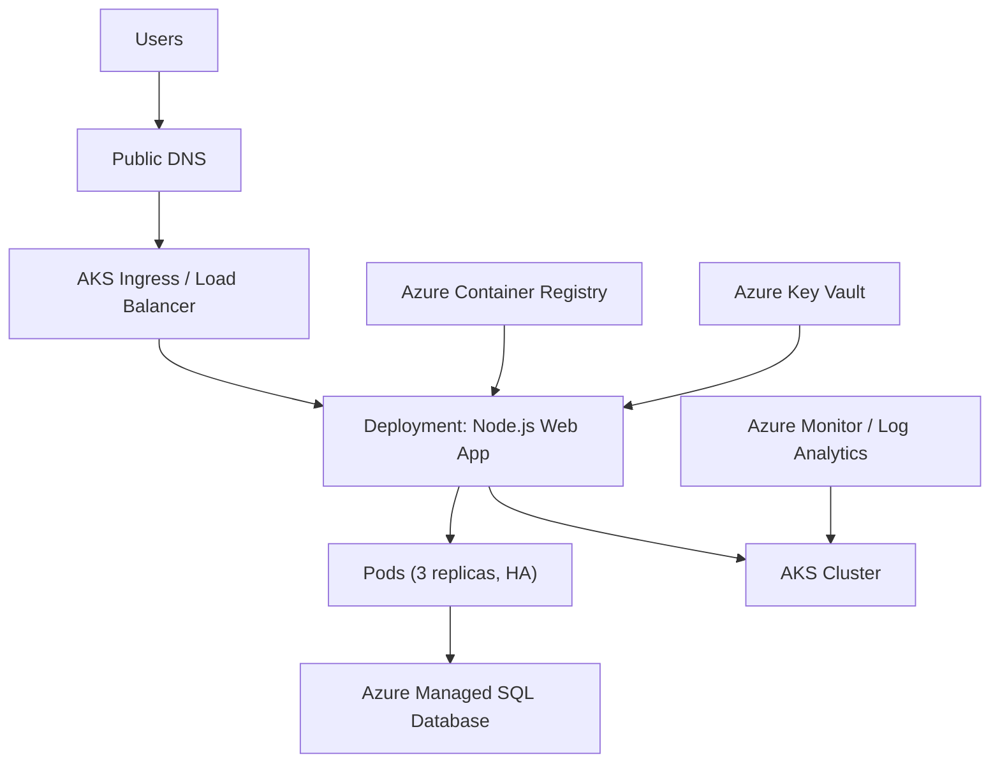

# High-Level Design (HLD): Lift-and-Shift of WebServerVM + SQLVM to AKS + Managed SQL

**Student:** Jigarkumar Patel  
**Lab:** Containerized Application with Managed Database

---

## Q1) Solution Diagram (Target Architecture)

---

## Q2) Target Architecture Description

* **Web Application:** The Node.js app from the old WebServerVM is containerized and deployed on Azure Kubernetes Service. A Deployment ensures multiple replicas for high availability. The app is exposed using an Ingress Controller behind a load balancer.
* **Database:** The SQL Server database from SQLVM is migrated to Azure Managed SQL Database. This provides automated patching, backups, and built-in high availability.
* **Container Registry:** Application images are stored in Azure Container Registry. The AKS cluster pulls the images securely for deployment.
* **Secrets:** Connection strings and credentials are stored in Azure Key Vault, which integrates with AKS for secure secret injection at runtime.
* **Observability:** Logs and metrics flow into Azure Monitor and Log Analytics for monitoring performance, availability, and troubleshooting.

**Benefits:**

* High Availability through multiple pods, managed SQL replication, and Azure-backed resiliency.
* Scalability via Kubernetes Horizontal Pod Autoscaler.
* Security using Key Vault, private connections, and TLS.

---

## Q3) Migration Steps

### Step 1: Containerization of Web Application

1. Prepare the Node.js app by externalizing database connection details into environment variables.
2. Create a Dockerfile using a lightweight Node.js image.
3. Build and push the container image to Azure Container Registry.

### Step 2: Database Migration

1. Run Data Migration Assistant to check SQL compatibility.
2. Provision Azure Managed SQL Database (or SQL Managed Instance if advanced SQL Server features are required).
3. Use Azure Database Migration Service to move schema and data from SQLVM to the managed service.
4. Validate the migrated database with test queries.

### Step 3: Kubernetes Configuration for High Availability

1. Provision an AKS cluster with multiple nodes across availability zones.
2. Deploy the Node.js container using a Deployment manifest with 3 replicas.
3. Configure an Ingress Controller with a public DNS entry.
4. Use Key Vault CSI driver for secret injection.
5. Set up Horizontal Pod Autoscaler and health probes.
6. Configure Azure Monitor and Log Analytics for metrics and alerts.

### Step 4: Cutover

1. Plan a downtime window (≤ 6 hours).
2. Stop writes to the old SQLVM.
3. Run final sync with Azure DMS.
4. Update DNS records to point to the AKS Ingress.
5. Validate app functionality and monitor performance.

---

### Acceptance Criteria

* Application runs on AKS with multiple replicas for HA.
* Database fully migrated to Azure Managed SQL with validated data integrity.
* Secrets managed via Key Vault.
* Observability in place via Azure Monitor.
* Migration completed within 6 hours downtime.
